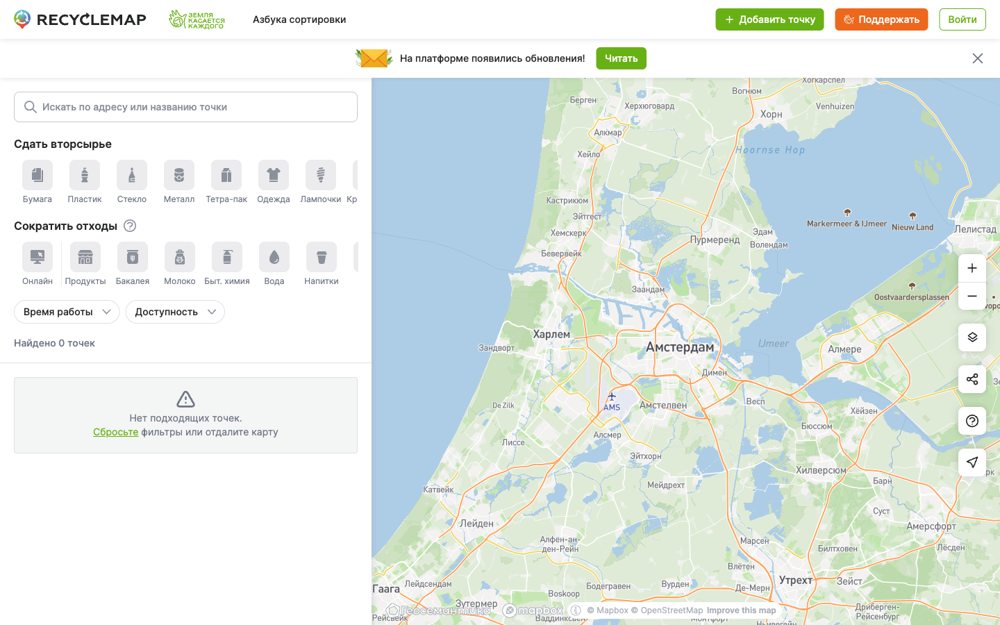
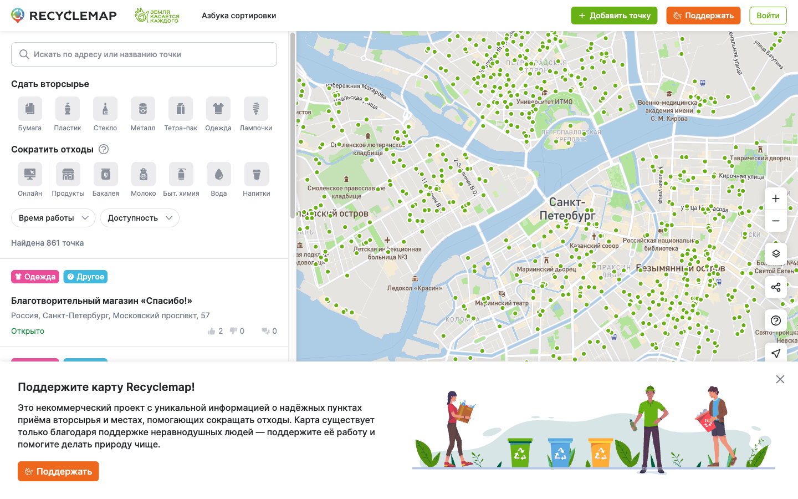
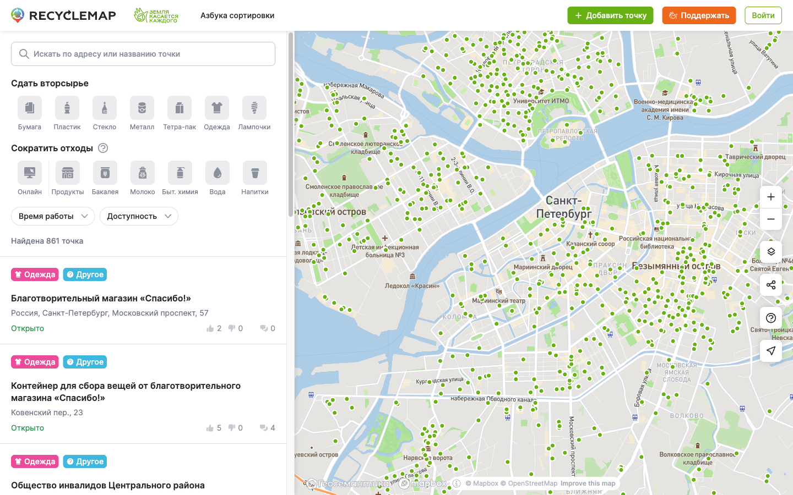
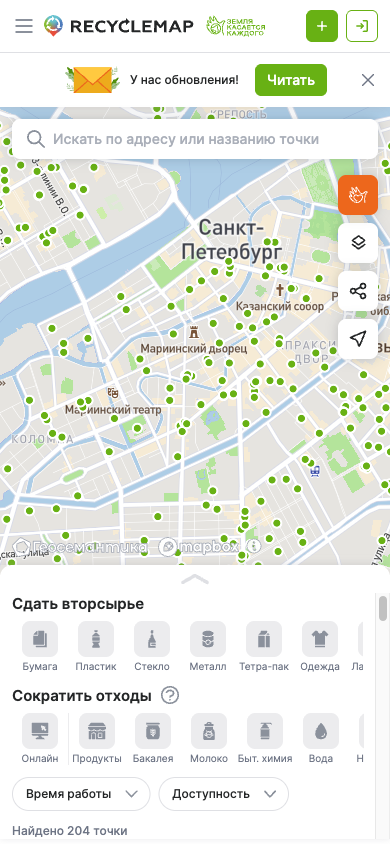
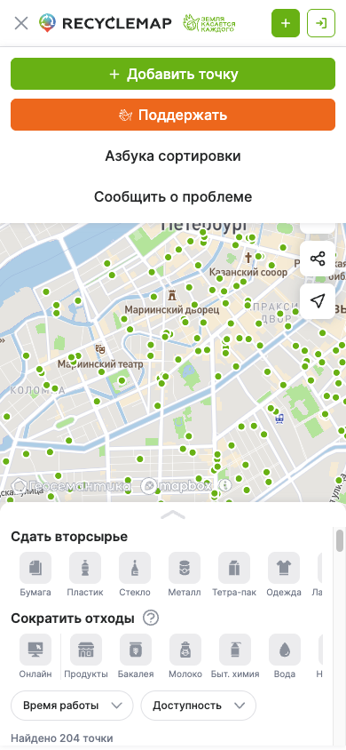
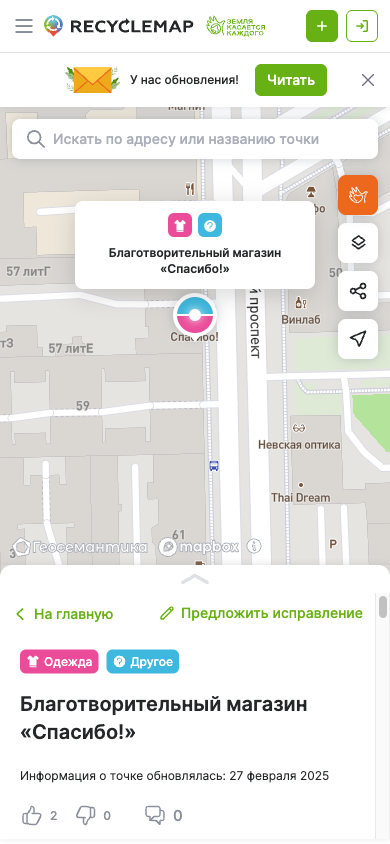
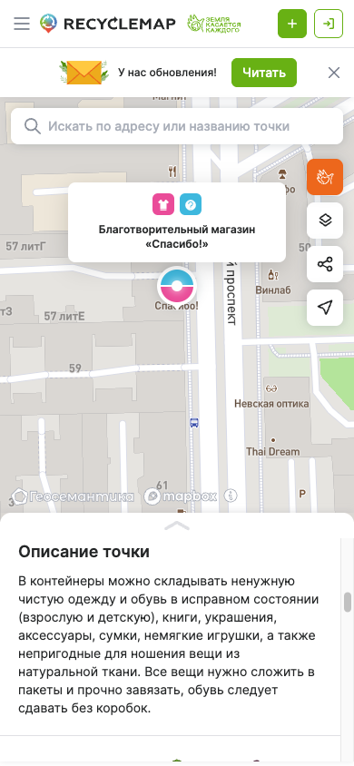

# recyclemap.ru — UX / Architecture Reference

Reconnaissance of https://recyclemap.ru captured on 2026-04-21 for the `RecycleMap СПб` learning clone.

**Legal note:** This document captures **patterns, structure, and data model observations**. We do not copy code, logos, icons, data, or text. It is background research — like reading a competitor's shop floor.

Screenshots live in `./recyclemap-ru-screenshots/`.

---

## 1. Main page — desktop (1440×900)

### Layout
Classic two-column "map app" layout:

- **Header** (56 px tall, white, full-width): Recyclemap logo (left) + partner logo "Земля касается каждого" + single nav item "Азбука сортировки"; on the right, three action buttons — `+ Добавить точку` (green fill), `Поддержать` (orange fill), `Войти` (green outline).
- **Announcement banner** directly under the header: "На платформе появились обновления!" with a green `Читать` CTA and an X to dismiss. (Closable, dismissal not persisted across reloads.)
- **Left sidebar** (≈510 px wide): search box → category filter panel → two dropdowns (`Время работы`, `Доступность`) → results counter → scrollable point list.
- **Map** (fills remaining viewport width): Mapbox GL, with a vertical stack of controls on the right edge — zoom +/−, layer switcher, share map, "сообщить о проблеме" (link to Google Forms), "find my location".
- **No footer on the map page.** A small "Геосемантика © Mapbox" attribution lives at the bottom of the sidebar.
- On first visit they also show a large **donate overlay card** at the bottom-left (screenshot `02-desktop-spb.png`) — closable and not repeat-shown during the session.

### Everything visible on the main page

| Element | Notes |
|---|---|
| Logo | SVG, colored pin-in-a-circle + wordmark `RECYCLEMAP` |
| Secondary logo | "Земля касается каждого" (parent brand, links to `earthtouches.me`) |
| Top nav | single item `Азбука сортировки` (placeholder page — loaded blank in our test) |
| Add point CTA | `+ Добавить точку` (green #68B114) — requires login, opens login modal |
| Donate CTA | `Поддержать` (orange, ~#ED671C, same as Пластик chip) |
| Login | `Войти` (green outline) |
| Search box | "Искать по адресу или названию точки" — with magnifying glass icon |
| Filter section 1 | "Сдать вторсырье" — 13 category chips, horizontally scrollable |
| Filter section 2 | "Сократить отходы" — 9 category chips, horizontally scrollable, with a `(?)` help icon |
| Dropdown 1 | `Время работы` |
| Dropdown 2 | `Доступность` |
| Results counter | `Найдено NNN точек` (grammatically correct cases — "точка/точки/точек") |
| Point list | Scrollable vertical list of cards |
| Map controls | zoom, layer, share, report problem, my-location |

### Colors (eyedropped from screenshots + verified via `getComputedStyle`)

| Role | Hex | Usage |
|---|---|---|
| Primary green | `#68B114` | `+ Добавить точку` button, "Круглосуточно"/"Открыто" status labels, green links |
| Primary orange | `#ED671C` | `Поддержать` button, Пластик chip |
| Body text | `#242627` | default `rgb(36,38,39)` |
| Page background | white |  |
| Panel dividers | light grey ≈ `#E5E7EB` |  |
| Chip base (inactive) | light grey ≈ `#F4F5F7`, dark icon |  |
| Chip text (inactive) | muted grey |  |

### Fonts
- Body and all UI: `Inter, sans-serif` (500 weight for buttons, 14/20 line height confirmed).
- Map labels: Mapbox renders in `DIN Pro Regular/Medium/Bold` (loaded from mapbox.com fonts API).

---

## 2. Categories / filter panel

The filter panel is divided into two named sections. Each is a horizontally-scrollable row of square icon-chips (≈56×56 px). Chip = icon on top + 1-word label below. Clicking a chip toggles its selected state; the selected chip fills with the fraction's brand color and the icon inverts to white.

### Section A — "Сдать вторсырье" (Recycle — type RC, 13 items)

Complete list as returned by `/api/public/fractions?types=rc,zw,or`:

| ID | Key | Label (RU) | Color | Icon |
|---|---|---|---|---|
| 1 | BUMAGA | Бумага | `#4085F3` | paper |
| 2 | PLASTIK | Пластик | `#ED671C` | plastic |
| 3 | STEKLO | Стекло | `#227440` | glass |
| 4 | METALL | Металл | `#E83623` | metall |
| 5 | TETRA_PAK | Тетра-пак | `#2CC0A5` | tetrapack |
| 6 | ODEZHDA | Одежда | `#EA4C99` | clothes |
| 7 | LAMPOCHKI | Лампочки | `#8F6EEF` | lightbulbs |
| 8 | KRYSHECHKI | Крышечки | `#DAA219` | caps |
| 9 | BYTOVAJA_TEHNIKA | Техника | `#C06563` | appliances |
| 10 | BATAREJKI | Батарейки | `#C8744E` | battery |
| 11 | SHINY | Шины | `#6F4D41` | tires |
| 12 | OPASNYE_OTHODY | Опасное | `#242627` | dangerous |
| 13 | INOE | Другое | `#3EB8DE` | other |

### Section B — "Сократить отходы" (Zero-Waste — type ZW, 9 items)

| ID | Key | Label (RU) | Color |
|---|---|---|---|
| 14 | SHOP | Онлайн | `#6B8E23` |
| 19 | GROCERY | Продукты | `#BF8565` |
| — | (bakery) | Бакалея | — |
| 17 | MILK | Молоко | `#5F8EE2` |
| 21 | CHEM | Быт. химия | `#423189` |
| 16 | WATER | Вода | `#436EA0` |
| 18 | DRINK | Напитки | `#CD5C5C` |
| 15 | FOOD | Еда | `#9F305F` |
| 20 | BOOK | Книги | `#4E1616` |
| 22 | VARIED | Разное | `#546E7A` |

There is also a third `type=OR` ("обмен/расхламление" — give-away/swap) with 11 more items (Одежда, Дом, Рукоделие, Доставка, Книги, Растения, Зоо, Дети, Еда, Другое, Ремесло) — not exposed in the default UI we saw.

### Filter UX

- Chips are **multi-select toggles** (not a radio group; two+ can be active). Selected count shown as `Очистить (N)` in the top-right of section A when anything is active.
- When a chip is tapped, the row auto-scrolls horizontally to center it and reveal prev/next chevrons (screenshot `25-desktop-filter-selected.png`).
- No per-category count shown on the chips themselves. Only total: `Найдено NNN точек`.
- URL is deep-linkable: selecting chips writes to `?fractions=1,2,9&active-layer=RC&center=LNG,LAT,ZOOM`.

### Dropdown 1 — Время работы

Radio-group dropdown (screenshot `05-filter-time-dropdown.png`): **Неважно · Открыто сейчас · Круглосуточно**.

### Dropdown 2 — Доступность

Radio-group dropdown (screenshot `06-filter-access-dropdown.png`): **Все точки · Только общедоступные · Только частные**.

### "Select all / reset"

- No "select all" control.
- Reset control appears as `✕ Очистить (N)` above the chip row, only when something is selected (see `25-desktop-filter-selected.png`).

---

## 3. Map behavior

### Library
**Mapbox GL JS**. Confirmed by:
- DOM: `div.mapboxgl-canvas-container, .mapboxgl-marker, .mapboxgl-ctrl-attrib`.
- Network: `api.mapbox.com/styles/v1/rc-map/clnq4wpji00ek01qy0mri8l5n`, tile fetches `…/mapbox.mapbox-terrain-v2,mapbox.mapbox-streets-v8/{z}/{x}/{y}.vector.pbf`, custom sprite, DIN Pro font glyphs (`…/fonts/v1/mapbox/DIN Pro *`).
- Public access token exposed on the client: `pk.eyJ1IjoienctbWFwIiwi…`.
- Attribution line: `© Mapbox © OpenStreetMap Improve this map`.

### Basemap & tiles
Custom Mapbox style (`rc-map/clnq4wpji00ek01qy0mri8l5n`) — a muted grey-green cartography, Russian labels for Cyrillic regions, soft water color. Also has a second preset **Спутник** (satellite imagery) selectable via a layer-switcher (screenshot `07-layer-selector.png`), which toggles between `Схема` (default) and `Спутник`.

### Markers
- Single unified marker sprite: a small green **dot** (colored `#68B114`-ish) is the default idle state on the map (screenshots `03`, `04`).
- No visible JS DOM `.mapboxgl-marker` nodes at viewing zoom — markers are rendered as a **Mapbox vector layer from the custom sprite**, which is why `document.querySelectorAll('.mapboxgl-marker')` returns 0. The sprite sheet is fetched from `…/sprite.png` + `…/sprite.json`.
- Selected marker transforms into a **larger circle + center white ring** and a floating white popup "card" anchored above (screenshot `08-point-detail.png`, `19-mobile-point-detail.png`). Selected-point popup shows **all its fraction icons** as colored circles (e.g. pink 👗 Одежда + cyan ? Другое).

### Clustering
- The API exposes `/api/tiles/get_hexaclusters/{z}/{x}/{y}` — so the intent is hex-based clustering at low zooms. We observed only individual dots even at z=6 (screenshots `21`, `22`, `23`). That may be because most hex tiles returned 204 (empty) and only the immediate SPb/Moscow clusters had data — so clusters may render only when density is extreme. In any case: the backend is cluster-aware.
- Separate endpoint `/api/tiles/get_points/{z}/{x}/{y}` serves the per-tile point GeoJSON at higher zooms.

### Default city / view
- The app on first load calls `https://api.geoapify.com/v1/ipinfo?apiKey=…` and centers on the IP-derived location. In our session (a non-RU IP was detected) the default was Amsterdam (`?center=4.904140,52.367600,9.00`). For RU users it presumably centers on their geocoded city.
- There is **no explicit city selector / dropdown** in the UI. You change location by panning/zooming or by searching in the address search box.

### Other map controls
- `+` / `−` zoom buttons
- Layer switcher — Схема / Спутник
- "Поделиться картой" (share map) — likely copies URL with current center+zoom+filters
- "Сообщить о проблеме" → opens a Google Form (`forms.gle/JXot13PDPKxgUock6`)
- "Find my location" — geolocation pin

---

## 4. Point detail

Opens **inside the left sidebar** as a full-column takeover (desktop) and as a **bottom-sheet modal on top of the map** (mobile). There is also a small popup **on the map** showing just the name and fraction icons (screenshots `08-point-detail.png`, `19-mobile-point-detail.png`).

URL becomes deep-linkable: `/viewer/points/{id}?center=…`.

### Header of the detail panel
- Back link: `< На главную`
- Action: `✎ Предложить исправление` (opens an edit-suggestion form, likely requires login)

### Data fields observed (sample point: id=120)

Listed top-to-bottom as rendered (screenshots `08`, `10`, `11`):

1. **Category chips row** — colored badges for every fraction accepted at the point (e.g. Одежда pink + Другое cyan).
2. **H1 — Point name**: "Благотворительный магазин «Спасибо!»".
3. **Last-updated line**: "Информация о точке обновлялась: 27 февраля 2025".
4. **Community voting row** — 👍 2 · 👎 0 · 💬 0 (upvotes, downvotes, comments count). The comment count is a link that jumps to the comments section.
5. **Address block**: address text + italic note ("Контейнер находится в благотворительном магазине «Спасибо»") + two routing icons — `Построить маршрут в Google Карты` (green pin) and `Построить маршрут в Яндекс.Карты` (red pin).
6. **Working hours**: status pill (`Открыто` / `Закрыто` / `Скоро закрывается` / `Круглосуточно`) + collapsible 7-day schedule (`График ∨`), expanded below: Пн–Вс 09:00–21:00.
7. **Описание точки** — rich text description of what the point accepts and how to prepare the materials.
8. **Donation banner** — "Поддержите карту Recyclemap!" + `Поддержать` button (cross-promotion, injected mid-page).
9. **Организация** — four rows: name (house icon), website (globe icon, linked), email (envelope icon, `mailto:`), phone (phone icon, digits, not clickable `tel:` in our test but displayed).
10. **Комментарии сообщества** — list of user comments with avatar initials, name, date, body (or "Комментарий был удален модератором" placeholder). `Показать все комментарии (N)` link + `Оставить комментарий` green button.
11. **Модераторы точки** — list with avatar initials, name, and a `✉ Написать` action per moderator.
12. **Поделиться**: VK, Odnoklassniki, Telegram, and `Ссылка` (copy-to-clipboard — toast "Скопировано") buttons.
13. **"Разработано Геосемантика"** credit line at the very bottom.

### Routing links
Yes — Google Maps and Yandex.Maps are explicitly supported (two icon-buttons next to the address). No OSM/2GIS.

---

## 5. Mobile version (390×844 — iPhone 14)

### Layout
- **Header** (48 px): hamburger ≡ (left), logo + partner logo, `+` (add point) and `↪` (login) icon-buttons (right). Three-column compressed header; all the text labels from desktop collapse to icons.
- **Announcement banner**: "У нас обновления!" — same format as desktop.
- **Map**: top ~55% of viewport, full-width, with right-side floating controls (orange `💫` "donate", layers, share, my-location).
- **Bottom sheet**: occupies the bottom ~35% by default. Shows a small drag handle chevron (`∧`). Swiping up expands it. Contents in collapsed state: search box (floats above the map), then categories → dropdowns → results count. When you swipe up, the full list becomes reachable.
- **No tabs; it is one integrated sheet.**

### Drawer menu (hamburger)
When the hamburger is tapped, the header becomes a vertical menu (not a side-drawer) listing: `+ Добавить точку`, `Поддержать`, `Азбука сортировки`, `Сообщить о проблеме`. The `X` close button replaces the hamburger (screenshot `14-mobile-menu.png`).

### Mobile point detail
- On point click, the selected marker appears with its card popup on the map (same as desktop).
- The bottom sheet changes content: header becomes `< На главную · ✎ Предложить исправление`, then the same long-form data as desktop — category chips, name, votes, address, hours, description, etc. (screenshot `19`, `20`).
- The map portion remains visible above so the user can still pan/zoom.

### Mobile filter
- Same horizontal chip row as desktop, but only ~6 chips visible at a time — relies on horizontal scroll.
- Dropdowns `Время работы` / `Доступность` stay on the same line.
- No full-screen "filter modal" pattern — the filter is always-visible in the bottom sheet.

---

## 6. Extra features

| Feature | Present? | Notes |
|---|---|---|
| User accounts | ✅ | Email+password login modal; "Зарегистрируйтесь" link for signup; "Восстановить пароль" for reset. Screenshot `12-add-point-requires-login.png`. |
| Add point | ✅ gated | Requires login. Opens a dialog; form content not captured (gated). |
| Search box | ✅ | Geocoding — by address "or point name". Not tested fully, but the placeholder suggests fuzzy over both. |
| "Near me" geolocation | ✅ | Pin-arrow button bottom-right of map. |
| Language switcher | ❌ | UI is RU-only. (Translations file at `/assets/i18n/ru.json` hints at potential i18n infra, but no switcher.) |
| About page | Partial | "Азбука сортировки" is the closest thing — a page about sorting categories. |
| Partners | Inline | Partner brand "Земля касается каждого" linked in header. |
| Donate | ✅ prominent | Top-nav button + card overlay on home + injected block on each point detail. Uses Yookassa / Yoomoney (network: `yookassa.ru/checkout-widget`, `yoomoney.ru/checkout`) + HubSpot forms (`js-eu1.hsforms.net`). |
| Social share (point) | ✅ | VK, OK, Telegram, copy-link. |
| Social share (map) | ✅ | "Поделиться картой" map control. |
| Export point URL | ✅ | Every point has a stable `/viewer/points/{id}` URL. Filters encoded in URL params. |
| Favorites / saved points | Hinted | Login modal copy says "сохранять точки в избранное" → feature exists for logged-in users. Not captured while logged out. |
| Comments | ✅ | Per-point threaded comments, moderated (we saw "Комментарий был удален модератором" placeholders). |
| Moderators | ✅ | Per-point moderator list with "Написать" contact action. |
| Voting | ✅ | Per-point 👍 / 👎 counters. Unclear if anonymous or login-gated. |
| "Предложить исправление" | ✅ | Every point has an edit-suggestion button (crowdsourced corrections). |
| Report a problem (map) | ✅ | Link to a Google Form — outsourced to Google Forms, not an internal endpoint. |

---

## 7. Tech hints

- **Framework**: **Angular** (app-root, app-header, app-home, app-map components; `ng-` attribute namespacing; generated hashed bundles `runtime.HASH.js`, `polyfills.HASH.js`, `main.HASH.js`; `ng-untouched ng-pristine ng-valid` class markers on form elements). `<html>` root has `data-critters-container` — they use Critters for critical CSS inlining.
- **CSS**: single bundled stylesheet `styles.1721f7969e964e70.css` + partner UI pulled from `pay.earthtouches.me/css/main.min.css?5`. Geometria custom font is loaded from the partner domain (`pay.earthtouches.me/font/Geometria/stylesheet.css`) but not actually used by the app (which ends up on `Inter`).
- **Map**: Mapbox GL JS with a custom style id. Token is a public `pk.…` access token.
- **Backend API** (same-origin, JSON, public endpoints):
  - `GET /api/public/headers` — bootstrapping headers / config
  - `GET /api/public/news/latest` — the announcement banner content
  - `GET /api/public/fractions?types=rc,zw,or` — all categories with colors/icons (data we mined above)
  - `GET /api/public/points?bbox=…&size=10&offset=0&restricted=null&types=rc,zw` — paginated list of points in a viewport
  - `GET /api/tiles/get_hexaclusters/{z}/{x}/{y}?fractions=&…&active_layer=zw,rc` — hex clusters per tile
  - `GET /api/tiles/get_points/{z}/{x}/{y}?…` — raw points per tile
- **Geocoding bootstrap**: `api.geoapify.com/v1/ipinfo` (third-party IP-geolocation).
- **Analytics**: Yandex.Metrika (clickmap + webvisor), HubSpot forms.
- **Payments**: Yookassa / Yoomoney widget loaded from `yookassa.ru/checkout-widget/v1/checkout-widget.js`.
- **PWA**: `link rel="manifest"` + `apple-touch-icon` + `theme-color` + `msapplication-TileColor` — installable PWA-ish.
- **SEO/SMM**: `og:title / og:type / og:url / og:image / og:description`, keywords meta, canonical URL, google-site-verification + two yandex-verifications.
- **URL pattern is semantic & deep-linkable**:
  - `/viewer?center=LNG,LAT,ZOOM` — main map
  - `/viewer?center=…&fractions=1,2&active-layer=RC` — filtered map
  - `/viewer/points/{id}?center=…` — point detail
  - `/viewer/points/{id}/comments?center=…` — point comments
  - `/abc` — Azbuka page (stub/unused in our visit)

---

## 8. Recommendations for our SPb MVP

### Worth copying (pattern-wise)

- **Two-section filter** (Сдать вторсырье / Сократить отходы). Even if we only ship the RC section for MVP, scaffold the UI so ZW is a second named group later. Don't mash everything into one list.
- **Horizontally-scrollable chip row with color-fill-on-select**. Icon on top, short label below. Auto-center the tapped chip. This solves the "we have 13 categories but only 6 fit on the screen" problem without a modal.
- **`Очистить (N)` reset control** only visible when N > 0. Cleaner than a permanently-visible "reset".
- **Multi-select filters with deep-linkable URLs** (`?fractions=1,2,9`). Makes sharing a filtered view free and gives us cheap "back/forward" for free.
- **Category chips as colored badges** on every point card — showing ALL accepted fractions, not just the selected ones. Lets the user see at a glance what else a point takes.
- **Results-count string with correct Russian plurals** ("Найдена 1 точка", "Найдено 2 точки", "Найдено 5 точек"). We should match this because it's instantly visible as Russian vs Google-translated sloppy English.
- **Two dropdowns for hours / access** (Время работы · Доступность). Radio groups with three simple options each — lightweight, covers 80% of filter cases.
- **Point detail IN the sidebar** on desktop and as **bottom-sheet** on mobile — not a popup. Popups get dismissed by any map click.
- **Google Maps + Yandex Maps routing buttons** next to the address. Both coexist (red Yandex pin, green Google pin). For SPb users, Yandex is essential.
- **Stable `/viewer/points/{id}` URL** for each point, and the URL params pattern for map state (`center=LNG,LAT,ZOOM`).
- **Share-map control** on the map itself (shares the URL).
- **Status pill under hours** with human labels: Открыто / Закрыто / Круглосуточно / Скоро закрывается. Computing "скоро закрывается" (< 1 h before close) is a nice touch worth borrowing.
- **IP-based default location** via a third-party geolocation (or HTML5 geolocation fallback) instead of a city dropdown. We could hardcode SPb for MVP but keep the expansion path open.

### Already in our plan — keep

- 8 categories (subset of their 13 RC) — fine, we're a learning MVP.
- Saint Petersburg only, 30 JSON points, no backend. (They have 814 in SPb and ~9 000 across RU — so our 30 is a toy set and that's OK for MVP.)
- Next.js + Leaflet + Tailwind. (They're Angular + Mapbox GL — different stack, same layout concept.)
- Filters on sidebar (desktop) + bottom sheet (mobile). Matches their pattern exactly — good call.

### Skip / out of scope for learning MVP

- **User auth / login / register / password recovery** — hugely complex, not needed for static 30-point MVP.
- **"Add point" crowd-sourcing form** and **"Предложить исправление"** moderation flow.
- **Per-point comments, voting, moderators** — entire social layer.
- **Tile-based API** (`get_hexaclusters`, `get_points`) — serves hundreds of thousands of points. With 30 points, load all in one JSON fetch. Only revisit when we have hundreds of points per city.
- **Geocoding search box** — non-trivial (Nominatim/Yandex/Geoapify integrations, CORS, debouncing). Skip; use a "scroll the map" UX for MVP.
- **Donate flow / Yookassa integration / HubSpot forms** — monetization concerns, not product concerns.
- **Layer switcher** (Схема / Спутник) — nice-to-have only; Leaflet with OpenStreetMap tiles is enough.
- **Analytics (Yandex Metrika)** — add later.
- **Multi-city support / city dropdown** — we are SPb-only. Ignore.
- **Third fraction type `OR` (обмен/расхламление)** — they have it but don't expose it in the UI either; definitely out of scope for us.
- **i18n infra** — copy is RU-only; inline the strings.
- **PWA manifest / install prompts** — cosmetic, later.

---

## Notes & gotchas

- Their marker sprites are a single Mapbox vector layer, not DOM `.mapboxgl-marker` elements — we cannot easily probe them with CSS/DOM. That's a Mapbox-specific pattern; with Leaflet we'll have real DOM markers.
- Mobile bottom-sheet drag is implemented with pointer events on a CSS `transform` container — not native `<dialog>`. If we use a library for the sheet (e.g. Headless UI + `vaul`), we'll get similar UX for free.
- "Геосемантика" (`geosemantica.ru`) is credited at the bottom — they appear to be the tech contractor behind the map. Not relevant for copying, just a context clue.
- The first visit to `recyclemap.ru` from my IP redirected to Amsterdam (Geoapify). Anyone new to the tool will see their own city first, which is nice.
- 13 RC fractions + 9 ZW fractions is a lot — expect that the SPb coverage is not uniform across all of them. Our 8-category MVP (plastic/glass/paper/metal/batteries/electronics/tetrapak/textile) is a reasonable subset; it maps to their ids 1, 2, 3, 4, 10, 9, 5, 6.
- Their color palette for categories is the thing I'd most want to learn from for our map. We've documented the full hex palette above.
